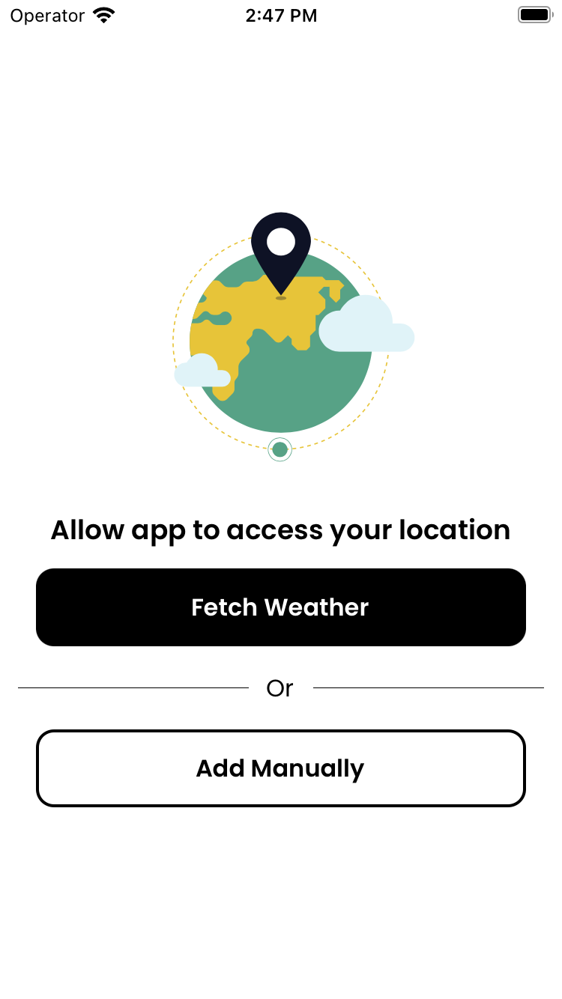
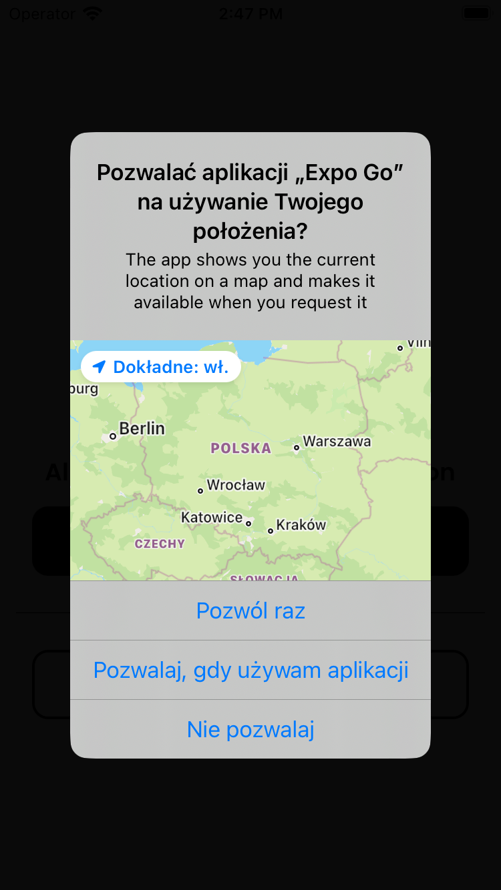
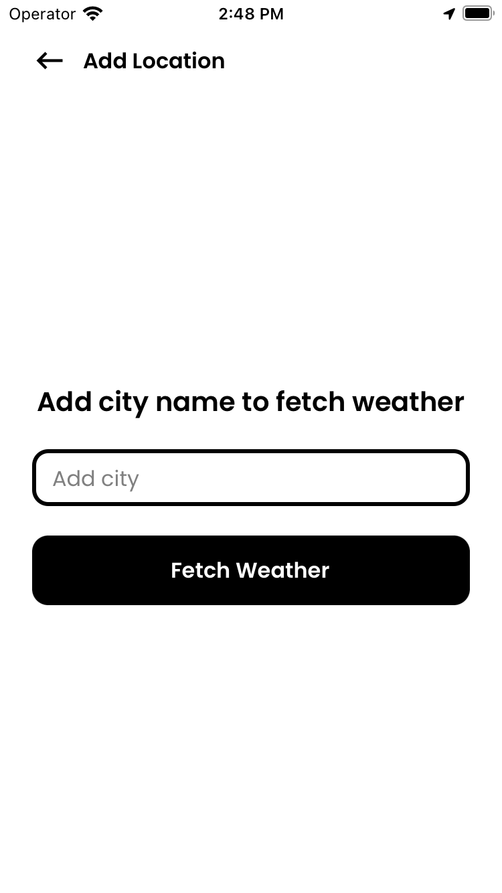
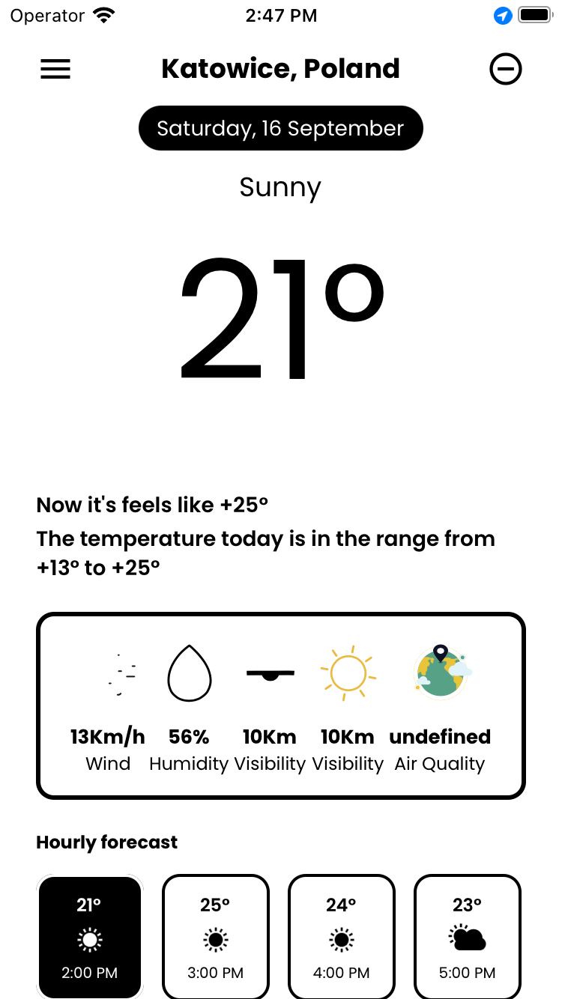
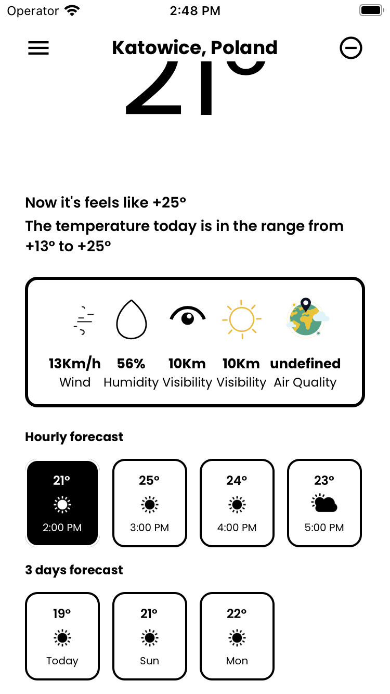

# Projekt UMPAnUMiW - Aplikacja pogodowa

Aplikacja pogodowa o minimalistycznym i nowoczesnym interfejsie użytkownika, stworzona przy użyciu React Native Expo CLI. Umożliwia użytkownikom pobieranie bieżącej lokalizacji lub ręczne wprowadzenie nazwy miasta, aby sprawdzić prognozę pogody. Aplikacja obsługuje dodawanie i usuwanie wielu miast oraz dostarcza dane dotyczące prognozy godzinowej i 3-dniowej. Dzięki przyjaznemu dla użytkownika interfejsowi użytkownika i menu wysuwającemu umożliwiającemu łatwą nawigację między różnymi miastami, Weather Snap sprawia, że sprawdzanie pogody staje się przyjemnością.

## Funkcjonalności

- Pobieraj bieżącą lokalizację lub ręcznie wprowadź nazwę miasta
- Dodawaj i usuwaj wiele miast
- Dane dotyczące prognozy godzinowej i 3-dniowej
- Przyjazny interfejs użytkownika o nowoczesnym designie
- Menu wysuwane dla łatwej nawigacji między miastami

## Wykorzystane technologie

- React Native Expo CLI
- Redux Toolkit
- Redux Persist

## Instalacja

Wymagane jedno z trzech: telefon, symulator Android, symulator iOS

1. Sklonuj repozytorium: `git clone` 
2. Przejdź do katalogu projektu
3. Zainstaluj zależności: `npm install`
4. Uruchom serwer Expo: `npm start`
5. Użyj aplikacji Expo Go na swoim urządzeniu mobilnym, aby zeskanować kod QR i otworzyć aplikację.
5.1. Opcjonalnie uruchom na symulatorze komendami `npm run ios` lub `npm run android`

## Zrzuty ekranu

